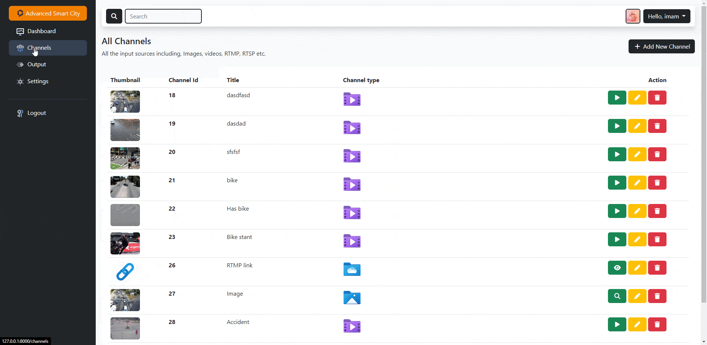

# CMRPACK 2.0 Advanced Smart City
Detect and track bikes, vehicles and pedestrians. Object tracking recognizes the same object across successive frames. Detects collisions and near misses. A real-time dashboard visualizes the intelligence extracted from the traffic intersection along with annotated video streams.

<p align="center">
    
</p>

## Development
| Details               |                                      |
|-----------------------|--------------------------------------|
| Framework:            | Django 4.1.3                         |
| UI-Framework:         | Bootstrap 5                          |
| Target OS:            | Windows 10, 11                       |
| Programming Language: | Python\* 3.5, 3.6, 3.7, 3.8, 3.9     |
| OpenVINO™ Toolkit:    | 2022.2 Latest standard release       |
| Build Tool:           | Microsoft Visual C++ 14.0 or greater |

## Requirements

### Hardware
- 6th to 12th Generation Intel® Core™ processors with Iris® Pro graphics or Intel® HD Graphics

### Software

- Windows\* 10, 11
- Microsoft Visual C++ 14.0 or greater
- Python\* 3.5 to 3.9
- Intel® Distribution of OpenVINO™ toolkit 2022.2 Latest standard release

## Supported Models
| Title                                        | Labels                                   |
|----------------------------------------------|------------------------------------------|
| person-vehicle-bike-detection-2000           | 0 - vehicle, 1 - person, 2 - bike        |
| person-vehicle-bike-detection-2001           | 0 - vehicle, 1 - person, 2 - bike        |
| person-vehicle-bike-detection-2002           | 0 - vehicle, 1 - person, 2 - bike        |
| person-vehicle-bike-detection-2003           | Not supported cause output size is 5     |
| person-vehicle-bike-detection-2004           | Not supported cause output size is 5     |
| person-vehicle-bike-detection-crossroad-0078 | 1 - person,  2 - vehicle, 3 - bike       |
| person-vehicle-bike-detection-crossroad-1016 | 0 - non-vehicle, 1 - vehicle, 2 - person |

## Setup
### Method #1
This is the easiest method. Open a directory where you want to place the project. Then open command prompt on that directory and execute given commands.
```text
git clone https://github.com/dace2it/Advanced-Smart-City.git
cd Advanced-Smart-City
start setup.bat
```
It will create a superuser for you. 
```text
Username: admin
Password: admin
```


### Method #2
* Clone the repo and navigate to the projects root directory
```text
git clone https://github.com/dace2it/Advanced-Smart-City.git
cd Advanced-Smart-City
```

* If your machine doesn't have virtualenv installed then install it by this command
```text
pip install virtualenv
```

* Create python interpreter
```text
virtualenv venv
```

* Install all requirements
```text
pip install -r requirements.txt
```

* Since we have created this project in django, so we have to make migrations
```text
python manage.py makemigrations
python manage.py migrate
```

* To create a superuser run this command. It will ask you to enter username, email and password
```text
python manage.py createsuperuser
```

* Finally, run the server on port 8000
```text
python manage.py runserver 8000
```
## Import channels
Import this CSV file to load 500+ CCTV channel.
```
Advanced-Smart-City/
├─ docs/
│  ├─ demo-data/
│  │  ├─ URLDashboardExport.csv
```

## Directory Tree

```
Advanced-Smart-City/
├─ analytics/
│  ├─ common/
│  │  ├─ images_capture.py
│  │  ├─ performance_metrics.py
│  ├─ object/
│  │  ├─ detector.py
│  ├─ processing/
│  │  ├─ frame_processing.py
│  ├─ tools/
│  │  ├─ remover.py
│  ├─ tracker/
│  │  ├─ centroidtracker.py
├─ apps/
│  ├─ authentication/
│  │  ├─ models.py
│  │  ├─ views.py
│  │  ├─ forms.py
│  │  ├─ urls.py
│  ├─ django_serverside_datatable/
│  │  ├─ views.py
│  │  ├─ datatable.py
│  ├─ functions/
│  │  ├─ functions.py
│  ├─ home/
│  │  ├─ models.py
│  │  ├─ db_helper.py
│  │  ├─ views.py
│  │  ├─ urls.py
│  │  ├─ utilities.py
│  │  ├─ forms.py
│  ├─ static/
│  │  ├─ assets/
│  │  │  ├─ css/
│  │  │  │  ├─ styles.css
│  │  │  ├─ img/
│  │  │  │  ├─ images
│  │  │  ├─ js/
│  │  │  │  ├─ index.js/
│  ├─ templates/
│  │  ├─ accounts/
│  │  ├─ home/
│  │  ├─ includes/
│  │  ├─ layouts/
│  │  ├─ modals/
│  ├─ config.py
│  ├─ context_processors.py
├─ core/
│  ├─ settings.py
│  ├─ urls.py
├─ intel/
│  ├─ person-vehicle-bike-detection-2004/
│  ├─ person-vehicle-bike-detection-crossroad-0078/
│  ├─ person-vehicle-bike-detection-crossroad-1016/
├─ media/
│  ├─ files/
│  │  ├─ thumbnails/
│  │  ├─ videos/
│  ├─ models/
│  ├─ screenshots/
├─ manage.py
├─ models.lst
├─ .gitignore
├─ db.sqlite3
├─ requirements-txt
├─ setup.bat
├─ start.bat
├─ README.md

```

## References
* <a href="https://www.python.org/downloads/release/python-370/">Python\* 3.7</a>
* <a href="https://www.python.org/downloads/release/python-380/">Python\* 3.8</a>
* <a href="https://www.python.org/downloads/release/python-390/">Python\* 3.9</a>
* <a href="https://visualstudio.microsoft.com/downloads/">Microsoft Visual Studio* with C++ 2019 or 2017 with MSBuild</a>
* <a href="https://www.intel.com/content/www/us/en/developer/tools/openvino-toolkit/download.html">OpenVINO™ Toolkit 2022.2 Latest standard release</a>

